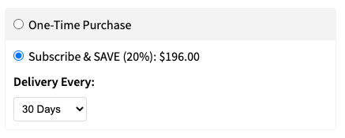

# @nacelle/react-recharge

Adds a React component [Recharge](https://rechargepayments.com/) subscriptions in your [Nacelle](https://getnacelle.com/) project.



## NOTICE

This package is deprecated. For up-to-date information and examples related to building frontend projects powered by Nacelle, please see [`docs.nacelle.com`](https://docs.nacelle.com/docs/heads) and the [`nacelle-js`](https://github.com/getnacelle/nacelle-js) repo.

## Requirements

- A Nacelle project set up locally. See https://docs.getnacelle.com for getting started.
- A Recharge app installed and setup on your Shopify store.

## Setup

### Add Module to Nacelle

Once you have Nacelle and Recharge set up you can install this module in your project from `npm`:

```
npm install @nacelle/react-recharge -S
```

### Metafields

Recharge sets important product metafields that we need to expose to Nacelle. We can do this with a simple graphql query using [Shopify's GraphQL Admin API](https://help.shopify.com/en/api/graphql-admin-api/reference/object/metafieldstorefrontvisibility)

This module adds an NPM command that can be run to expose these, and only needs to be run once during the initial setup

```sh
npx expose-metafields store=<your-myshopify-domain> token=<your-shopify-admin-api-token>
```

This command will query the Admin API to expose the metafields needed. The value for `store` is, for example, `starship-furniture` if the store's Shopify domain is `starship-furniture.myshopify.com`. Please note that the `token` _must_ be the GraphQL Admin API token.

## Usage

```jsx
import { RechargeSelect } from '@nacelle/react-recharge';

<RechargeSelect product={product} getCartMetafields={getCartMetafields} />;
```

### Props

- **product (required):** A Shopify Product object
- **getCartMetafields (required):** This is a callback function that is passed to the component and will return the values of metafields that should be integrated into the cart. Every time the user changes between the delivery frequency or the type of purchase, this callback will be run and provide updated metafields. When the item is added to cart, these metafields should be appended to any other metafields required in the cart.
- **disabled:** Disable the input
- **subscriptionLabel:** The label that is used for the subscription selection section of the component. The default value is 'Subscribe'
- **oneTimeLabel:** The label that is used for the single purchase selection section of the component. The default value is 'One-Time Purchase'
- **containerStyles:** Any additional styles that should be applied to the containing div
- **onChange:** Any action that should take place when a value is changed. This function is passed the React synthetic event for the input change

Example of `getCartMetafields`:

```js
const itemMetafields = useRef([]);

const getCartMetafields = (cartMetafields) => {
  // type CartMetafield = {
  //   key: 'charge_interval_frequency' | 'order_interval_frequency' | 'order_interval_unit';
  //   value: string;
  // }
  itemMetafields.current = cartMetafields;
};
```

### Example

An example integration with Nextjs can be found [here](https://github.com/getnacelle/nacelle-react/tree/main/examples/withRecharge).
