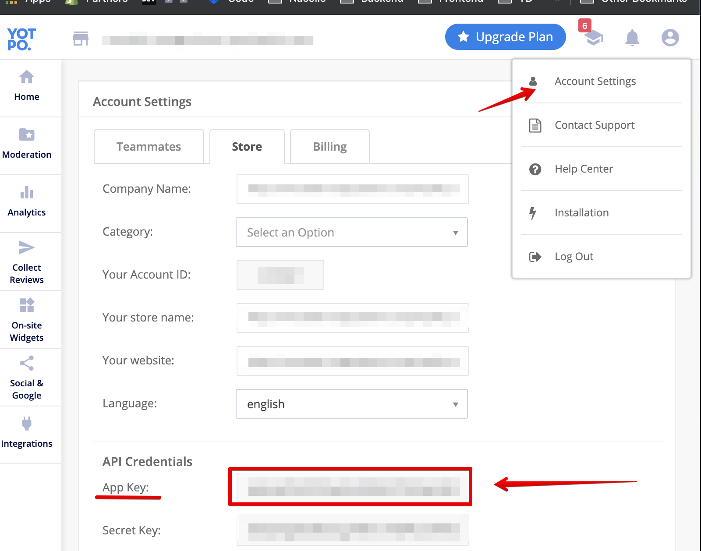

# @nacelle/react-yotpo

Adds React components for [Yotpo](https://www.yotpo.com/) product reviews in your [Nacelle](https://getnacelle.com/) project.


## Requirements

- A Nacelle project set up locally. See https://docs.getnacelle.com for getting started.
- A Yotpo account and app installed on your Shopify store.

## Setup

### Add Module to Nacelle

Once you have Nacelle and Recharge set up you can install this module in your project from `npm`:

```
npm install @nacelle/react-yotpo -S
```

After the package is installed, you'll need to create a `.env` file in the root of the project that contains credentials for your store:

```
YOTPO_API_KEY=
```

The company ID is found in the `Acccounts > Settings > API Keys` section of the Klaviyo admin dashboard.



## Usage

### useYotpoRefresh

This is a React hook that will call Yotpo's `refreshWidgets` function when a component is mounted or updated. This ensures that the components show up-to-date information. This call is debounced so that it does not occur too often. The default debounce time is 200 milliseconds, but this can be changed by passing another value to `useYotpoRefresh`.

```jsx
import { useYotpoRefresh } from '@nacelle/react-yotpo';

const Component = () => {
  useYotpoRefresh(400);

  return <div />;
};
```

### YotpoReviews

Adds a div element to the dom that Yotpo will use to add product reviews.

```jsx
import { YotpoReviews } from '@nacelle/react-yotpo';

<YotpoReviews
  product={shopifyProductObject}
  price={productPrice}
  urlPath={productUrlPath}
/>;
```

### YotpoStarRating

Adds a div element to the dom that Yotpo will use to add product ratings.

```jsx
import { YotpoStarRating } from '@nacelle/react-yotpo';

<YotpoStarRating productId={shopifyProductId} />;
```

### YotpoScripts

Provides a component that will mount `<script>` tags with the Yotpo JS scripts. This component should be used at the bottom of the `<head>` element.

```jsx
import { YotpoScripts } from '@nacelle/react-yotpo';

<head>
  <!-- app code -->
  <YotpoScripts />
</head>
```

### Example

An example integration with Nextjs can be found [here](https://github.com/getnacelle/nacelle-react/tree/main/examples/withYotpo).
